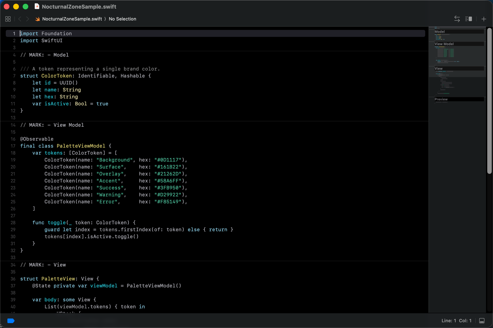

# NocturnalZone — Xcode Color Theme

A dark color theme for [Xcode](https://developer.apple.com/xcode/) based on the NocturnalZone brand palette.



## Installation

Copy `NocturnalZone.xccolortheme` to your Xcode themes directory:

```bash
mkdir -p ~/Library/Developer/Xcode/UserData/FontAndColorThemes
cp NocturnalZone.xccolortheme ~/Library/Developer/Xcode/UserData/FontAndColorThemes/
```

Then restart Xcode and select the theme in **Settings → Themes → NocturnalZone**.

## Palette

### Editor

| Role         | Hex       |
| ------------ | --------- |
| Background   | `#000000` |
| Current Line | `#18181d` |
| Selection    | `#2c2c2e` |
| Invisibles   | `#3a3a3c` |
| Cursor       | `#a9a9b3` |

### Syntax Highlights

| Token                                       | Hex       |
| ------------------------------------------- | --------- |
| keyword                                     | `#79c0dc` |
| function / declaration                      | `#27b8c8` |
| url                                         | `#79c0dc` |
| function.system                             | `#5bd2e0` |
| type / class / declaration.type             | `#d6c95f` |
| type.system / class.system                  | `#dcd497` |
| string / character / markup.code            | `#3fb085` |
| number                                      | `#fbbccc` |
| attribute / constant / macro / preprocessor | `#c47fd4` |
| constant.system / macro.system              | `#d6b3de` |
| plain                                       | `#9d9da6` |
| variable                                    | `#919198` |
| variable.system                             | `#a9a9b3` |
| comment                                     | `#787879` |
| comment.doc.keyword / mark                  | `#a9a9b3` |
| markup.aside.kind                           | `#d6c95f` |

### Scrollbar Markers

| Role          | Hex       |
| ------------- | --------- |
| Error         | `#ff7a9e` |
| Warning       | `#d6c95f` |
| Analyzer      | `#d6c95f` |
| Diff          | `#f4a823` |
| Diff Conflict | `#d6c95f` |
| Runtime Issue | `#c47fd4` |
| Breakpoint    | `#007acc` |

## License

[MIT](LICENSE)
